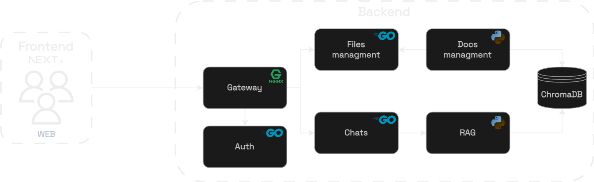
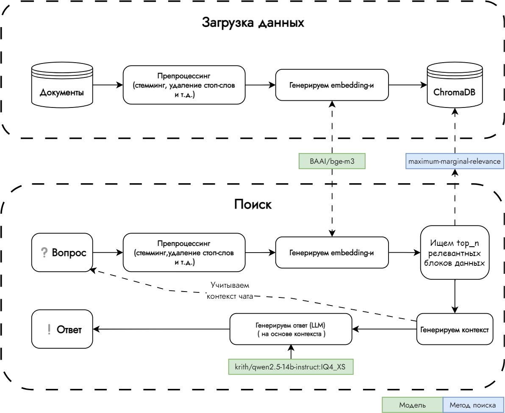

# 👾SmartVault — умный помощник для быстрого доступа к нужной информации.

## 📋 Содержание

- [Архитектура решения](#-архитектура-решения)
  - [Основные части приложения](#основные-части-приложения)
  - [Архитектура наглядно](#архитектура-наглядно)
- [Описание алгоритма чат-бота](#описание-алгоритма-чат-бота)
  - [Новый вопрос от пользователя](#новый-вопрос-от-пользователя)
  - [Получение векторных представлений](#получение-векторных-представлений)
  - [Генерация контекста](#генерация-контекста)
  - [Генерация ответа](#генерация-ответа)
  - [RAG pipeline наглядно](#rag-pipeline-наглядно)

## 🧱 Архитектура решения

В качестве основных языков программирования были выбраны `Python`, `Go`, `Typescript`.

### 🔩 Основные части приложения

- `WEB-приложение` - клиентская часть для взаимодействия с чат-ботом (`TypeScript`, `NextJS`) [(Репозиторий)](https://github.com/mzhn-mzhnr/frontend)
- `Backend` - сервисы написанные на `Go` (`PostgreSQL`)
  - Сервис для взаимодействия с чатами [(Репозиторий)](https://github.com/mzhn-mzhnr/chats)
  - Сервис для управления файлами [(Репозиторий)](https://github.com/mzhn-mzhnr/fs)
  - Сервис авторизации [(Репозиторий)](https://github.com/mzhn-mzhnr/auth)
- `RAG` - система поиска релевантной информации, написана на `Python` (`ChromaDB`)
  - Сервис с `RAG` pipeline-ом [(Репозиторий)](https://github.com/mzhn-mzhnr/ai)
  - Сервис управления документами, генерации `embedding` для них [(Репозиторий)](https://github.com/mzhn-mzhnr/vector_store_manager)

### 🖼️ Архитектура наглядно

 

## 🗯️ Описание алгоритма чат-бота

Чат-бот использует RAG pipeline, он включает в себя:

- Препроцессинг
- Получение векторных представлений (`embedding`, `bi-encoder`)
- Формирования контекста
- Генерация ответа на основе контекста (`LLM`)

### ❓Новый вопрос от пользователя

Каждый вопрос проходит через удаление стоп-слов, стемминг и токенизацию.

### 🔢Получение векторных представлений

С помощью модели `BAAI/bge-m3` получаем `embedding` вопроса

> [!Note]
> Мы пробовали различные модели для генерации embedding-ов, но многие из них показывали плохой результат на многоязычности, самой лучшей из них оказалась `bge-m3`

### 🛠️ Генерация контекста

Используя [`Maximum Marginal Relevance`](https://retrieval-tutorials.vercel.app/retrieval-methods/maximum-marginal-relevance) находим `top_k` подходящих чанков из `ChromaDB`

> [!Note]
> Для улучшения пользовательского опыта мы так же учитываем в контексте вопросы и ответы из текущего диалога

### ❗Генерация ответа

LLM (`krith/qwen2.5-14b-instruct:IQ4_XS`) генерирует итоговый ответ на основе контекста

> [!Note]
> Нами был подобран промпт который минимизировал галлюцинации, если в контексте нет подходящей информации она ответит - "Я не знаю ответа на Ваш вопрос"

### 🖼️ RAG pipeline наглядно

 

