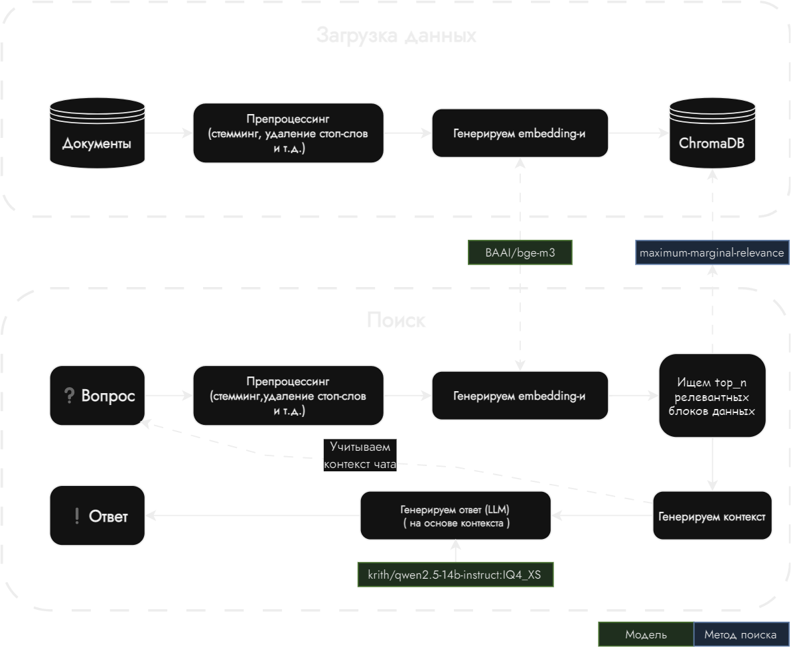

# :space_invader: SmartVault — умный помощник для быстрого доступа к нужной информации.

## :clipboard: Содержание

- [:space_invader: SmartVault — умный помощник для быстрого доступа к нужной информации.](#space_invader-smartvault--умный-помощник-для-быстрого-доступа-к-нужной-информации)
  - [:clipboard: Содержание](#clipboard-содержание)
  - [:bricks: Архитектура решения](#bricks-архитектура-решения)
    - [:nut_and_bolt: Основные части приложения](#nut_and_bolt-основные-части-приложения)
    - [:framed_picture: Архитектура наглядно](#framed_picture-архитектура-наглядно)
  - [:right_anger_bubble: Описание алгоритма чат-бота](#right_anger_bubble-описание-алгоритма-чат-бота)
    - [:question: Новый вопрос от пользователя](#question-новый-вопрос-от-пользователя)
    - [:1234: Получение векторных представлений](#1234-получение-векторных-представлений)
    - [:hammer: Генерация контекста](#hammer-генерация-контекста)
    - [:exclamation: Генерация ответа](#exclamation-генерация-ответа)
    - [:framed_picture: RAG pipeline наглядно](#framed_picture-rag-pipeline-наглядно)
- [Без них ничего бы не было \<3](#без-них-ничего-бы-не-было-3)

## :bricks: Архитектура решения

В качестве основных языков программирования были выбраны `Python`, `Go`, `Typescript`.

### :nut_and_bolt: Основные части приложения

- `WEB-приложение` - клиентская часть для взаимодействия с чат-ботом (`TypeScript`, `NextJS`) [(Репозиторий)](https://github.com/mzhn-mzhnr/frontend)
- `Backend` - сервисы написанные на `Go` (`PostgreSQL`)
  - Сервис для взаимодействия с чатами [(Репозиторий)](https://github.com/mzhn-mzhnr/chats)
  - Сервис для управления файлами [(Репозиторий)](https://github.com/mzhn-mzhnr/fs)
  - Сервис авторизации [(Репозиторий)](https://github.com/mzhn-mzhnr/auth)
- `RAG` - система поиска релевантной информации, написана на `Python` (`ChromaDB`)
  - Сервис с `RAG` pipeline-ом [(Репозиторий)](https://github.com/mzhn-mzhnr/ai)
  - Сервис управления документами, генерации `embedding` для них [(Репозиторий)](https://github.com/mzhn-mzhnr/vector_store_manager)

### :framed_picture: Архитектура наглядно

 

## :right_anger_bubble: Описание алгоритма чат-бота

Чат-бот использует RAG pipeline, он включает в себя:

- Препроцессинг
- Получение векторных представлений (`embedding`, `bi-encoder`)
- Формирования контекста
- Генерация ответа на основе контекста (`LLM`)

### :question: Новый вопрос от пользователя

Каждый вопрос проходит через удаление стоп-слов, стемминг и токенизацию.

### :1234: Получение векторных представлений

С помощью модели `BAAI/bge-m3` получаем `embedding` вопроса

> [!Note]
> Мы пробовали различные модели для генерации embedding-ов, но многие из них показывали плохой результат на многоязычности, самой лучшей из них оказалась `bge-m3`

### :hammer: Генерация контекста

Используя [`Maximum Marginal Relevance`](https://retrieval-tutorials.vercel.app/retrieval-methods/maximum-marginal-relevance) находим `top_k` подходящих чанков из `ChromaDB`

> [!Note]
> Для улучшения пользовательского опыта мы так же учитываем в контексте вопросы и ответы из текущего диалога

### :exclamation: Генерация ответа

LLM (`krith/qwen2.5-14b-instruct:IQ4_XS`) генерирует итоговый ответ на основе контекста

> [!Note]
> Нами был подобран промпт который минимизировал галлюцинации, если в контексте нет подходящей информации она ответит - "Я не знаю ответа на Ваш вопрос"

### :framed_picture: RAG pipeline наглядно

 

# Без них ничего бы не было ❤️

 

 

